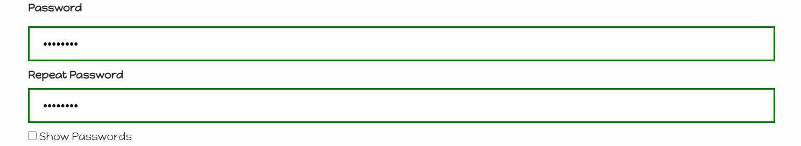
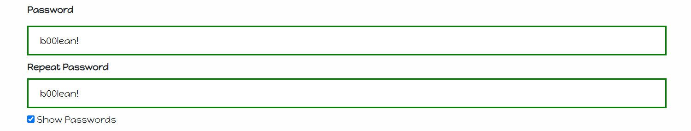
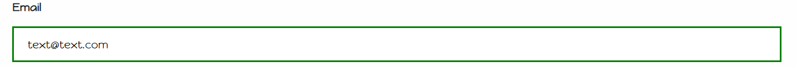
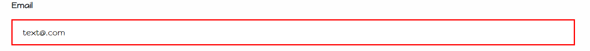

# Sunshine-D8

Group Project
https://zalina4813.github.io/Sunshine-D8/

# Project Description 
The concept of our project is the facilitation of deciding what to do for a date night. Our goal is to make date-planning easier, complete with customized suggestions based on user input. The categories will be:

● Food & Drinks  
● Activities

# Webpage Components
Libraries​:  
● HTML5  
● CSS  
● Bootstrap  
● Jquery  
● API calls using AJAX

# APIs:

● Yelp -- https://www.yelp.com/dataset○https://www.yelp.com/dataset/documentation/main & https://www.yelp.com/developers/documentation/v3/business_search
Yelp Fusion
We used this API to pull details from Yelp’s database for two searches: Restaurants & Activities. 
We created selector fields for type and zip code for each to return appropriate results.
(AJAX Used to pull data) 

● Mapbox -- https://docs.mapbox.com/api/maps/
Map Box
We used this API to show where the results pulled from Yelp are located. The user can quickly see where the various results are based on the interactive map. 
(AJAX Used to pull data)

# New Technology - Javascript Plugins
Both of the plugins below were used on our sign-in homepage form.  
● X-Ray.js  
Allow the user to show/hide password strings in their password field when needed.  
  ● Hide Password  
  
  ● Show Password  
  
● Validator.js  
Forces the user to have some sort of email to the degree of being at least 'text@text.com'  
  ● Valid Email  
  
  ● Invalid Email  
  

# Repeating Elements
Yelp API Displays
Using for loops, we generated repeating elements for activities and restaurants:
Image
Business Name
Phone Number
Rating
Link to Reviews on Yelp

# Design Layout
CSS
Bootstrap:
Cards
Modals
Columns/Rows
Buttons
Nav Bar

# Validation Specs
Log-In Authentication= required
Both search fields (type and zip)= required
Zip Code- Limited to 5 characters

# Team Members 
* Austin Kennedy 
* Zalina Magiday
* Dana Nobile 
* Joshua Maldonado
* Majid Modak
* Jackie Geiger 
